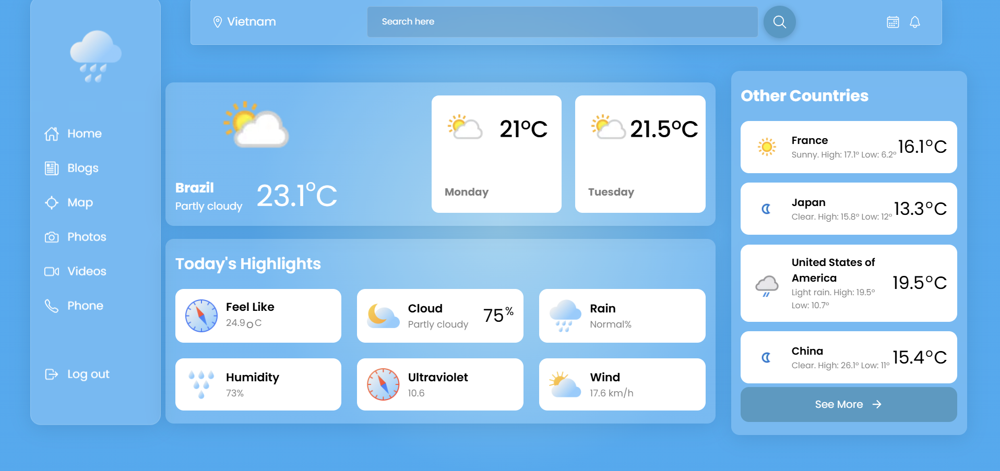

# 🌦️ Weather Forecast App - React + Vite

Ứng dụng dự báo thời tiết đơn giản sử dụng **ReactJS** và **Vite**, hỗ trợ cập nhật thời tiết thời gian thực từ API.

## 🚀 Công nghệ sử dụng

- [React](https://reactjs.org/) - UI Library
- [Vite](https://vitejs.dev/) - Công cụ build siêu nhanh
- [Axios](https://axios-http.com/) - Gọi API
- [Weather API](https://www.weatherapi.com/) - API dự báo thời tiết

---

## 📦 Cài đặt và chạy dự án

### 1. Clone dự án:
    ```bash
    git clone https://github.com/PhucThinh2002/weather-web
    ```

### 2. Cài đặt dependencies:
    npm install

### 3. Chạy ứng dụng:
    npm run dev


### Màn hình
    ****
